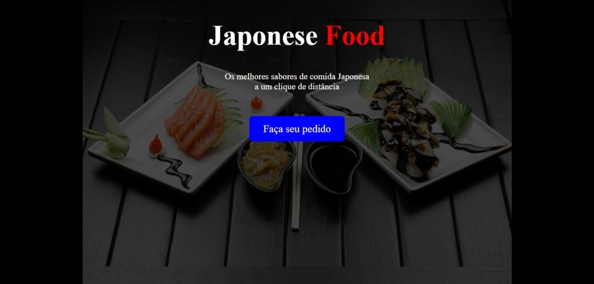

# Projeto de Página de Comida Japonesa

Este projeto consiste em uma página web simples com o objetivo de apresentar um serviço de comida japonesa e direcionar os usuários a fazerem seus pedidos através do WhatsApp.

**Principais Características:**

* **Título Chamativo:** Apresenta um título em destaque sobre comida japonesa.
* **Breve Descrição:** Fornece uma frase concisa incentivando o pedido.
* **Link Direto para Pedido:** Contém um botão/link que abre uma conversa no WhatsApp com um número de telefone predefinido e uma mensagem inicial para facilitar o pedido.
* **Design Minimalista:** Utiliza um esquema de cores simples (preto e branco com destaque em vermelho) e uma imagem de fundo temática para criar uma atmosfera visual relacionada à culinária japonesa.
* **Animações Sutis:** Incorpora pequenas animações de fade-in nos elementos de texto e no link ao carregar a página, proporcionando uma experiência visual mais agradável.
* **Responsividade:** O layout é adaptável a telas menores, como as de dispositivos móveis, através de uma media query que ajusta o tamanho da fonte.

**Objetivo:**

O principal objetivo deste projeto é criar uma página de destino (landing page) direta e eficaz para um serviço de delivery de comida japonesa, simplificando o processo de pedido ao direcionar o cliente diretamente para o contato via WhatsApp.

**Estrutura:**

O projeto é composto por dois arquivos principais:

* `index.html`: Contém a estrutura do conteúdo da página (título, descrição, link).
* `style.css`: Define a apresentação visual da página (cores, fontes, imagem de fundo, layout, animações).

**Público-Alvo:**

Clientes interessados em pedir comida japonesa de forma rápida e prática através do WhatsApp.

**Tecnologias Utilizadas:**

* HTML: Para a estrutura do conteúdo.
* CSS: Para a estilização e apresentação visual.

Em resumo, este é um projeto web básico, focado em funcionalidade e simplicidade, com o intuito de facilitar o contato e o pedido de comida japonesa através do WhatsApp.